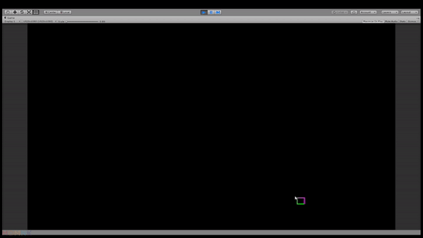

# SelectionBox2D for Unity3D

2D box selector for Unity3D which uses line segments to draw a rectangle.

## Usage

**[Download the latest release](https://github.com/mdmnk/SelectionBox2D/releases/latest) and import it into your project**

1. Drag the `SelectionBox2D.prefab` into your scene
1. Choose a mouse button to map the box selector to
1. Modify styles via the attached line renderer component

**Alternative usage method**

1. Extend `SelectionBox2D.cs` and override methods accordingly
1. Attach new script to a GameObject in your scene
1. attach a line renderer with the same settings as `SelectionBox2D.prefab`
